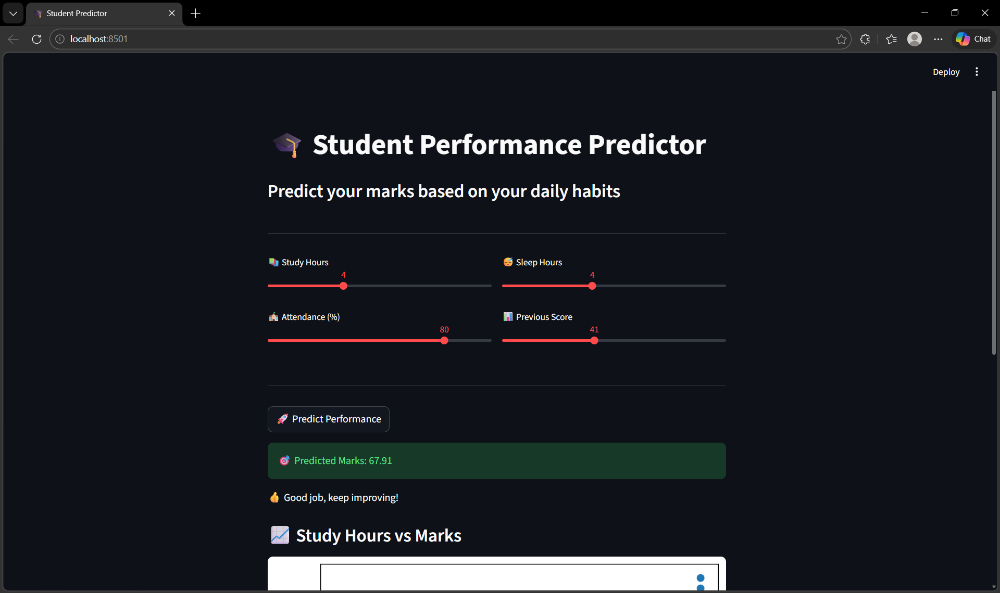

# 🎓 Student Performance Predictor

A Machine Learning project that predicts student marks based on study habits such as study hours, attendance, sleep, and previous performance.

---

## 🚀 Features
- Predicts student performance using Machine Learning
- Uses Linear Regression algorithm for prediction
- Interactive web interface built with Streamlit
- Visual representation of data using graphs

---

## 🛠️ Tech Stack
- Python
- Pandas
- Scikit-learn
- Matplotlib
- Streamlit

---

## 📂 Project Structure
student-performance-predictor/
│── dataset.csv
│── model.py
│── app.py
│── model.pkl
│── requirements.txt

---

## ▶️ How to Run

1. Install dependencies: pip install -r requirements.txt
2. Train the model: python model.py
3. Run the application: streamlit run app.py

---

## 📸 Project Preview

### 🔹 Input Interface

### 🔹 Prediction Output

---

## 📌 Conclusion
This project demonstrates how machine learning can be used to predict student performance based on daily habits. It highlights the importance of data-driven decision-making in education.

---

## 🔮 Future Scope
- Use real-world datasets for better accuracy
- Implement advanced ML models
- Deploy as a full web application
- Add more features like stress level and screen time

---

## 👩‍💻 Author
Bhoomika Kushwaha
