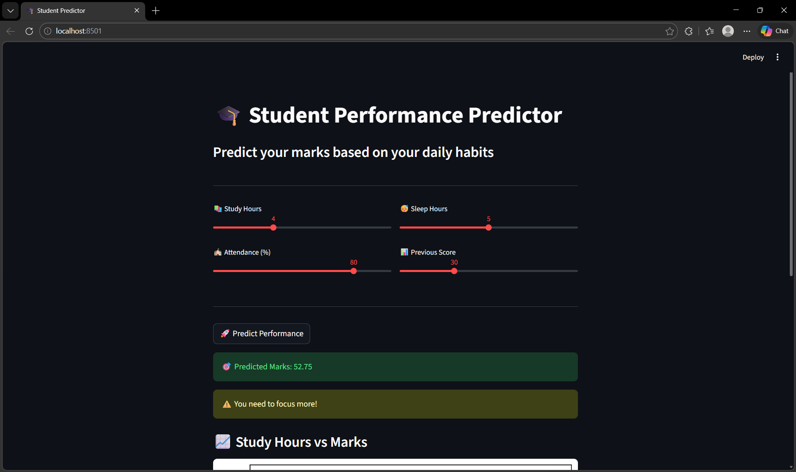
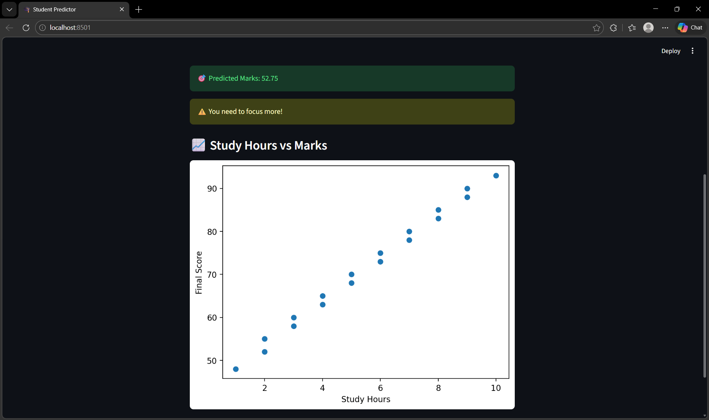

# 🎓 Student Performance Predictor

A Machine Learning project that predicts student marks based on study habits.

## 🚀 Features
- Predicts student performance using ML
- Uses Linear Regression algorithm
- Interactive UI built with Streamlit

## 🛠️ Tech Stack
- Python
- Pandas
- Scikit-learn
- Matplotlib
- Streamlit

## ▶️ How to Run

1. Install dependencies:
pip install -r requirements.txt

2. Train model:
python model.py

3. Run app:
streamlit run app.py

## 📸 Project Preview

### 🔹 Input Interface

### 🔹 Prediction Output

